# idea导入项目参数释义

平时大家都是使用idea直接打开项目，但对于一个新接手的项目来说首要的操作是import；这样做的好处有：

1. 当项目未上传gradle文件时可以手动选择本地对应版本编译
2. 方便进行首次的gradle sync操作
3. 自动适配更新为当前电脑的配置环境

但是大家在导入项目时会有较多的选项，这些选项都有什么用处呢；咱们来看看。

演示代码来自课程：[《Socket网络编程进阶与实战》](https://coding.imooc.com/class/286.html)

## 准备

- idea：2018.3
- 构建工具：gradle
- 项目：Socket网络编程进阶与实战

## 目录结构

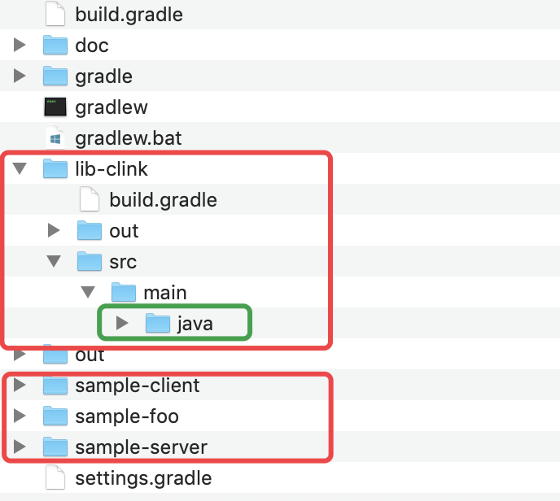

整个目录包含4个module文件夹：

- lib-clink
- sample-client
- sample-foo
- sample-server

而每个文件夹下的代码都放在 **src/main** 中

当你什么都不做，使用默认模式导入时你的项目是这样的：

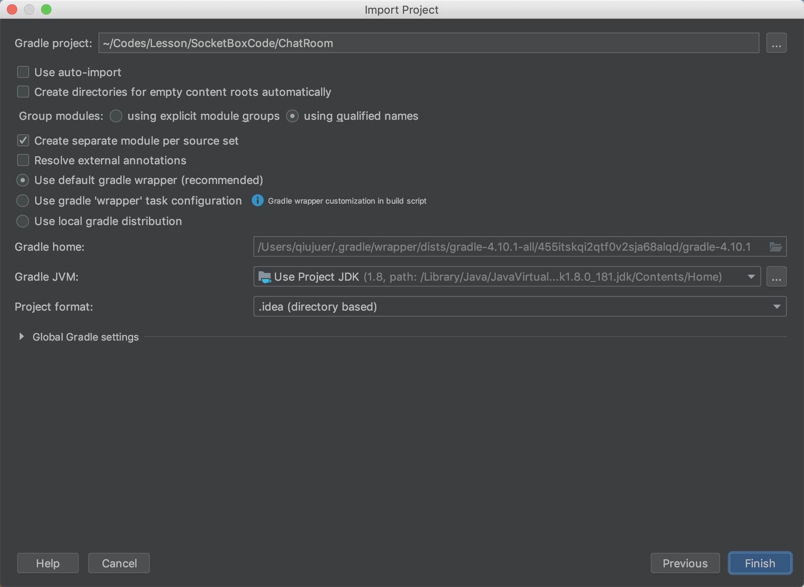

Project视图下没有毛病，当我们切换到packages下看见的是这样的：

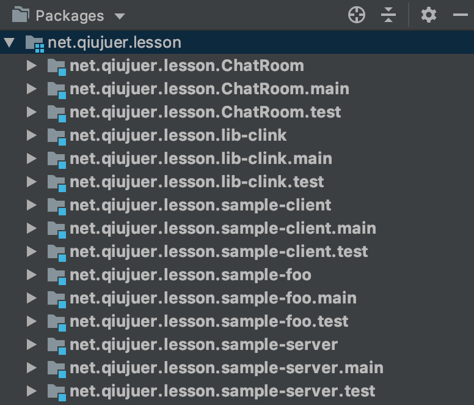

可以看见，每一个module都被赋予了 **默认、main、test** 所以你看见的module将变得更多，由于我们只有main下面具有代码，所以此时只有 main module下才有代码，其他module下无代码。

## 基础配置

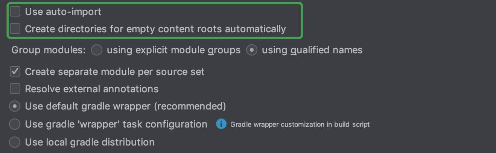

1. **自动导入**，作用与字面意思一样；当你的项目有依赖一些第三方库时需要勾选，此时导入项目后会自动下载依赖的库，并完成依赖过程
2. 这个也简单，简单来说就是有些项目只有build配置，并没有初始化代码，而这个勾选的作用就是自动为你创建模版。
   1. 一般新建项目时可勾选自动创建模版文件
   2. 若仅仅需要创建项目，而代码结构需要自己来则不用勾选
   3. 导入项目时一般无需勾选
3. 这个地方就很玄幻了：**使用显式Module组**、**使用限定的名称**
   1. 显式Module组：简单来说你可以自己在项目中创建对应的群组，然后将代码划分到不同的群组中，这可以让你的代码更有结构。
   2. 限定的名称：idea默认的选项。其概念与Java9 Jigsaw模块化一样。选择该选项，项目的module组合方式idea将根据Java理解代码的分组方式直观的组织模块；所以你看见的都是散列的一个个module。

### 显式Module组

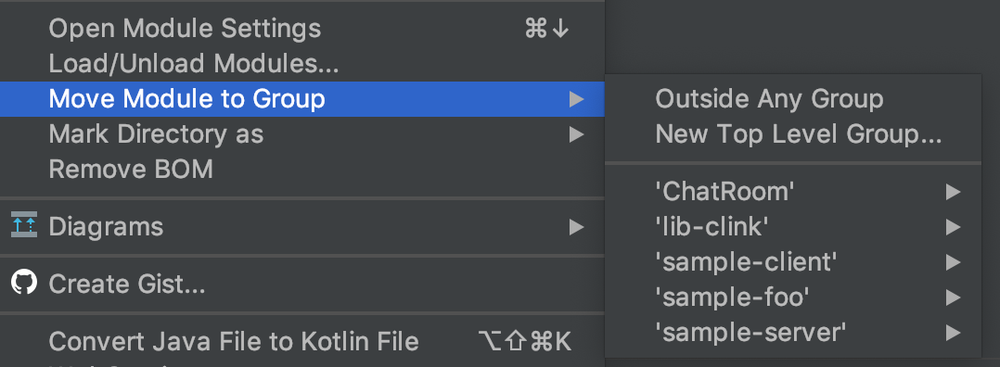

你可以在对应的文件夹上右键，调整不同的module到不同的组中，以便让你的项目更加结构化；当然一般情况下，咱们不操作。

在该模式下，咱们Packages视图将变成群组的方式呈现：

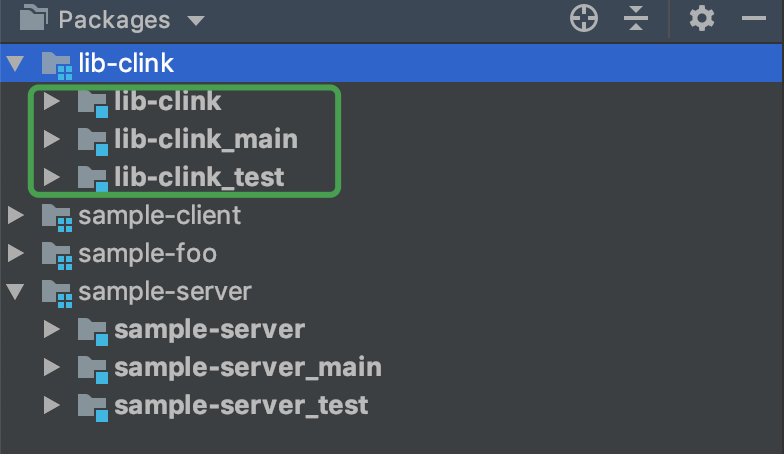

默认的。在每个分组内部有默认、main、test分组存在。

上面打断了一下，现在我们来看看这两个：

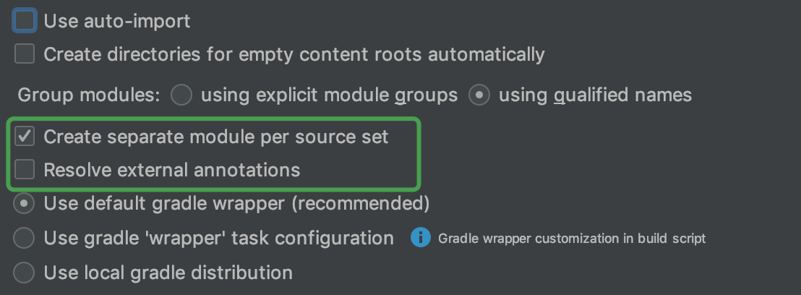

## create separate module per source set

为每个代码源都创建独立的module**；默认的一个项目下会有 **main、test** 所以采用该方式导入时会将我们所理解的一个module显示为3个，其中包括了 main、test以及一个外部的总代码文件夹。

当前选项可以与 **Group modules** 选项配合使用达到不一样的效果。

选中的效果大家已经看见了，我们来看看不选中的效果。

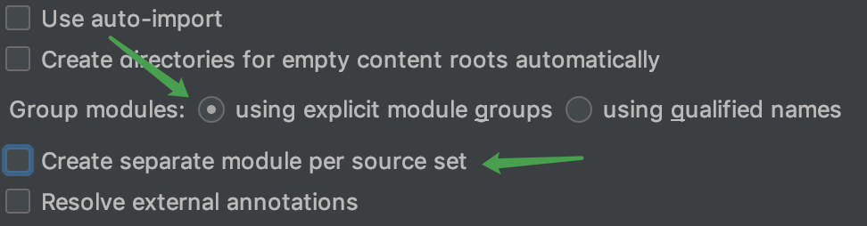

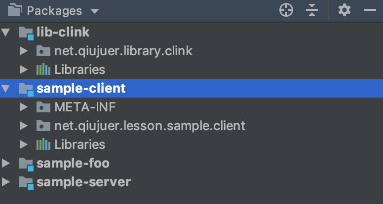

Packages呈现的就是main代码下的样式，因为当前test本身没有代码存在，所以这是比较合理的组织方式。

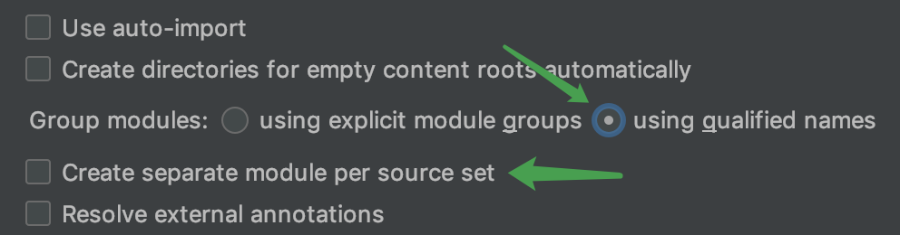

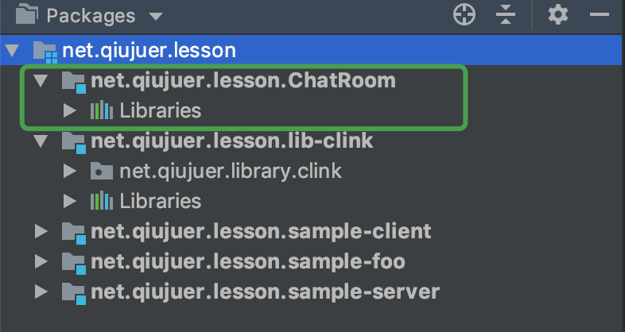

在这种方式下，会多一个外部主的文件夹module，其他类似，但名称有所不同，module名称显示的是主包名结构，这也就是idea采用java模块化自动推断的显示方式。

## Resolve external annotations

这个选项，想必大家都很少看见吧；这个选项的主要作用是在导入时自动解决**外部注解**的显示与应用。这里有个新东西：外部注解。

外部注解本身不是新事物，主要是大家很少使用而已，主要用以不同ide之间同步注解使用，相当于把源代码中的注解提取出来在外部建立一个XML文件进行维护，代码中使用对应的标记进行应用。

idea外部注解详见：[External annotations](https://www.jetbrains.com/help/idea/external-annotations.html)

默认的，咱们都不管他，一般没有特殊需求不需要勾选。

## Gradle导入设置

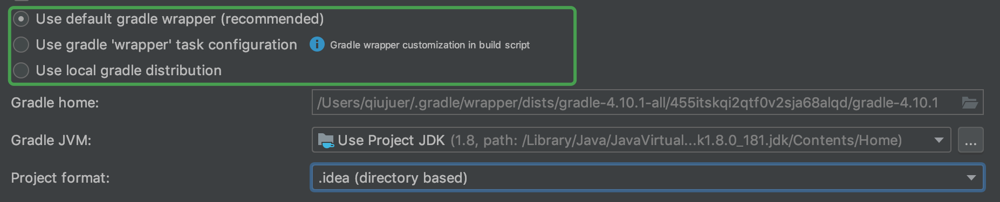

1. 使用默认的gradle wrapper 这是idea推荐的方式，会自动使用项目中的build信息进行下载gradle对应版本（如果本地没有的话）
2. 第二个，则是会使用wrapper的节点配置下载指定的版本；具体的可以看看：[stackoverflow](https://stackoverflow.com/questions/24811997/android-studio-use-default-gradle-wrapper-vs-use-customizable-gradle-wrappe/27122704#27122704) 和 [Configuring a Gradle version for a project](https://www.jetbrains.com/help/idea/gradle.html)
3. 第三个，则使用本地版本，如果你知道项目使用的版本，并且项目本身没有上传gradle文件夹的时候，可以选择该选项，选择一个本地的版本是非常不错的选择。当你选择后可以在下面的选项框中选择你本地的gradle文件。默认的在 **user/.gradle/wrapper/dists/** 你也可以自己去网站上下载。

## 全局Gradle配置

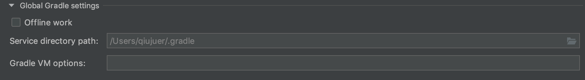

这个部分主要负责是否启用离线工作模式，该模式一般在项目已经正常导入过，本地已有对应依赖库缓存的时候使用，不然将无法编译通过。

文本框主要是设置本地的仓库地址，以及环境参数；这里就不做展开了。

在离线模式下，编译时将不会去尝试搜索下载依赖项目，一定程度上可以加快整个构建流程，但是一般不建议使用该选项，除非你的本地已有缓存的依赖，同时你的电脑无法连接到远端maven仓库时才使用（运营商搞鬼，要翻墙）。

好的以上就是idea导入项目的详解；我们需要注意的一般都是前5条选项。

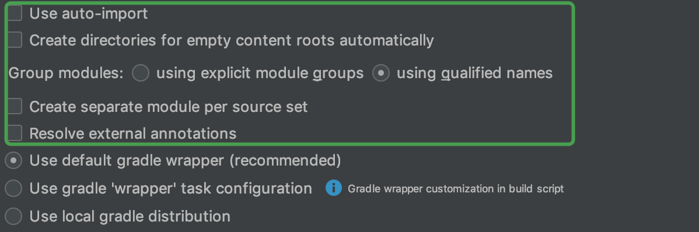

啰嗦一句：演示代码来自课程：[《Socket网络编程进阶与实战》](https://coding.imooc.com/class/286.html) 这是一门讲解Socket原理与运用的课程，脱去demo层面的理解；能让你快速胜任socket相关的工作。

